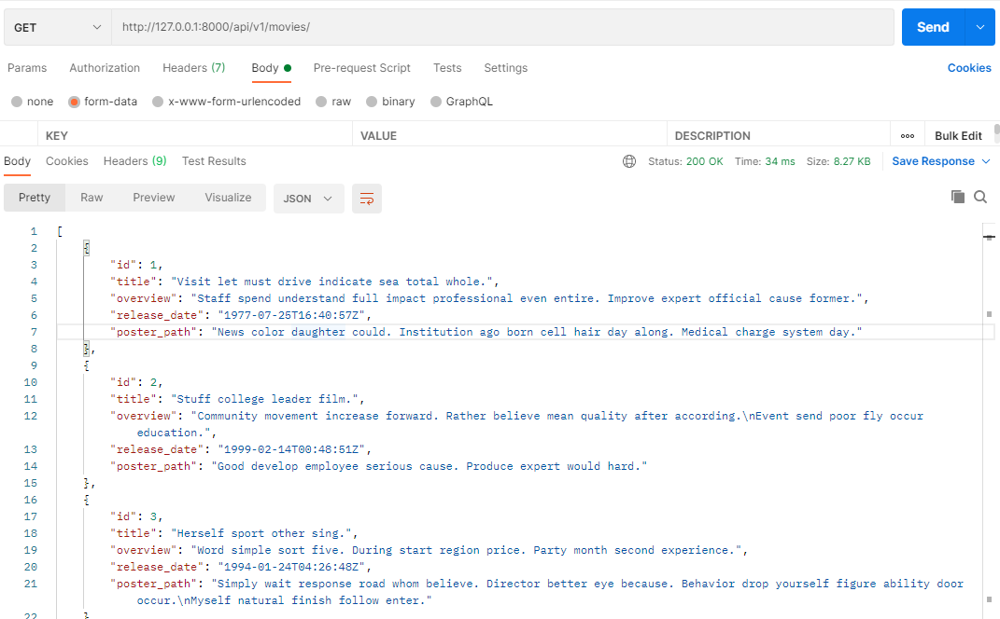
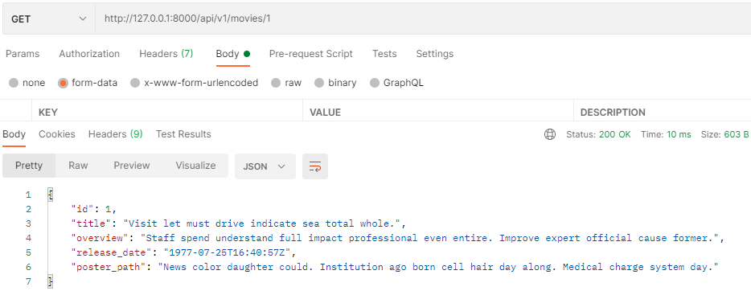

# Project08

> 데이터베이스 설계를 통한 REST API 설계


- **목표**
  - 데이터를 생성 조회 수정 삭제 할 수 있는 A PI Server 제작
  - Django Rest Framework 를 통한 데이터 조작
  - Database 관계 의 이해와 설정

- **느낀점**

  - 오랜만에 장고 프로젝트를 해서, 낯설긴 했지만, 페어와 이야기 하면서 재밌게 할 수 있었다.
  - 나는 드라이버, 페어는 내비게이터를 했었는데, 아직 serializer를 사용하는 것과 postman사용하는게 익숙치 않았는데 페어가 잘 알려주어서 조금 익숙해졌다.
  - 오늘도 페어에게 고맙다.

  ____


- **movies/models.py**

  ```python
  from django.db import models
  
  class Movie(models.Model):
      title = models.CharField(max_length=100)
      overview = models.TextField()
      release_date = models.DateTimeField()
      poster_path = models.CharField(max_length=200)
  
  class Review(models.Model):
      movie = models.ForeignKey(Movie, on_delete=models.CASCADE)
      title = models.CharField(max_length=100)
      content = models.TextField()
      rank = models.IntegerField()
  
  class Comment(models.Model):
      review = models.ForeignKey(Review, on_delete=models.CASCADE)
      content = models.CharField(max_length=100)
  ```

  

- **movies/serializers.py**

  ```python
  from rest_framework import serializers
  from .models import Movie, Review, Comment
  
  # 전체 movie Serializer
  class MovieListSerializer(serializers.ModelSerializer):
      class Meta:
          model = Movie
          fields = '__all__'
  
  # movie Serializer
  class MovieSerializer(serializers.ModelSerializer):
      class Meta:
          model = Movie
          fields = '__all__'
  
  # review Serializer
  class ReviewSerializer(serializers.ModelSerializer):
      class Meta:
          model = Review
          fields = '__all__'
          read_only_fields = ('movie', )
  
  # comment Serializer
  class CommentSerializer(serializers.ModelSerializer):
      class Meta:
          model = Comment
          fields = '__all__'
          read_only_fields = ('review', )
  ```

- **movies/urls.py**

  ```python
  from django.urls import path
  from . import views
  urlpatterns = [
      
      
      
  
      ## COMMENT
      path('movies/<int:movie_pk>/reviews/<int:review_pk>/comment/', views.comment_create),
      path('movies/<int:movie_pk>/reviews/<int:review_pk>/comment/<int:comment_pk>/', views.comment_list),
  ]
  
  ```

- **movies/views.py** -- import

  ```python
  from django.shortcuts import get_list_or_404, get_object_or_404
  from rest_framework.response import Response
  from rest_framework.decorators import api_view
  from rest_framework import status
  
  from .models import Movie, Review, Comment
  
  from .serializers import MovieListSerializer, MovieSerializer, ReviewSerializer, CommentSerializer
  ```

- **movies/views.py -- movie**

  ```python
  # movies/urls.py
  ## MOVIE 
      path('movies/', views.movie_list),
      path('movies/<int:movie_pk>/', views.movie_detail),
  ```

  ```python
  # movies/views.py
  @api_view(['GET'])
  def movie_list(request):
      movies = get_list_or_404(Movie)
      serializer = MovieListSerializer(movies, many=True)
      return Response(serializer.data, status=status.HTTP_200_OK)
  
  @api_view(['GET'])
  def movie_detail(request, movie_pk):
      movie = get_object_or_404(Movie, pk = movie_pk)
      serializer = MovieSerializer(movie)
      return Response(serializer.data)
  ```

  - http://127.0.0.1:8000/api/v1/movies/

   

  - http://127.0.0.1:8000/api/v1/movies/1

  


- **movies/views.py -- review**

  ```python
  # movies/urls.py
  ## REVIEW
  path('movies/<int:movie_pk>/reviews/', views.review_create),
  path('movies/<int:movie_pk>/reviews/<int:review_pk>/', views.review_detail_delete_update),
  ```

  ```python
  # movies/views.py
  @api_view(['POST'])
  def review_create(request, movie_pk):
      movie = get_object_or_404(Movie, pk = movie_pk)
      serializer = ReviewSerializer(data = request.data)
      if serializer.is_valid(raise_exception=True):
          serializer.save(movie= movie)
          return Response(serializer.data, status=status.HTTP_201_CREATED)
          
  
  @api_view(['GET', 'PUT', 'DELETE'])
  def review_detail_delete_update(request, movie_pk, review_pk):
      review = get_object_or_404(Review, pk= review_pk)
  
      if request.method == 'GET':
          serializer = ReviewSerializer(review)
          return Response(serializer.data)
  
      elif request.method == 'DELETE':
          review.delete()
          data ={
              'message' : f'{review_pk}가 삭제되었습니다.'
          }
          return Response(data, status=status.HTTP_204_NO_CONTENT)
  
      elif request.method == 'PUT':
          serializer = ReviewSerializer(review, data=request.data)
          if serializer.is_valid(raise_exception=True):
              serializer.save()
              return Response(data=serializer.data, status= status.HTTP_202_ACCEPTED)
  ```

- **movies/views.py -- comment**

  ```python
  ## COMMENT
      path('movies/<int:movie_pk>/reviews/<int:review_pk>/comment/', views.comment_create),
      path('movies/<int:movie_pk>/reviews/<int:review_pk>/comment/<int:comment_pk>/', views.comment_list),
  ```

  ```python
  @api_view(['POST'])            
  def comment_create(request, movie_pk, review_pk):
      serializer = CommentSerializer(data=request.data)
      review = get_object_or_404(Review, pk=review_pk)
  
      if serializer.is_valid(raise_exception=True):
          serializer.save(review=review)
          return Response(serializer.data, status = status.HTTP_201_CREATED)
  
  
  @api_view(['GET'])            
  def comment_list(request, movie_pk, review_pk, comment_pk):
      comment = get_object_or_404(Comment, pk = comment_pk)
      serializer = CommentSerializer(comment)
      return Response(serializer.data)
  ```

  

